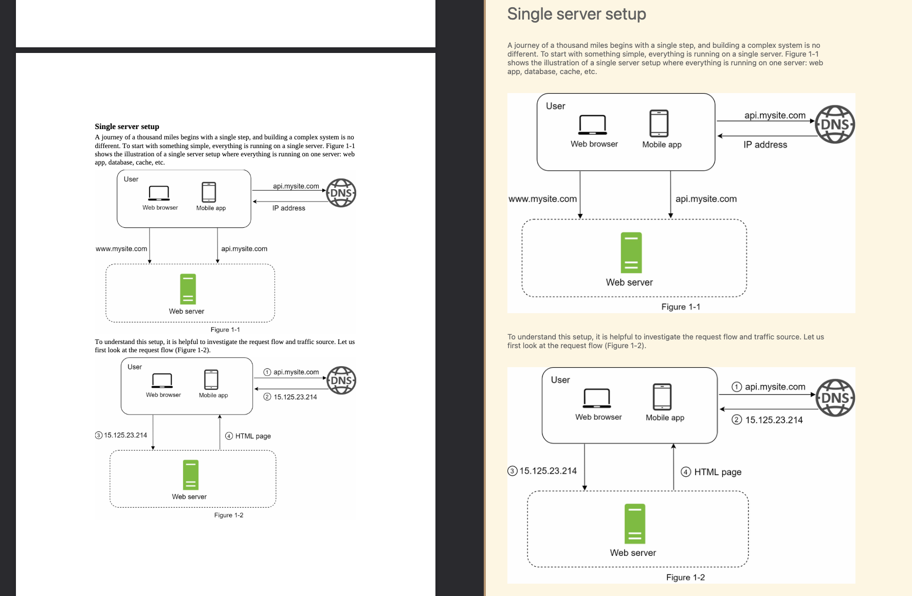

# pdf-to-ipynb

Turn any PDF into a Jupyter notebook with one command.

- Bold headings → `#` / `##` / `###` cells
- Body text → markdown cells
- Diagrams → embedded images
- Code snippets → runnable code cells (OCR handles code that's baked into images)

## Preview

PDF on the left, generated notebook on the right:



---

## Before you start

You need two things installed:

**1. Python 3.10 or newer** — check with:
```bash
python3 --version
```

**2. Tesseract** (reads text from images):
```bash
# macOS
brew install tesseract

# Ubuntu / Debian
sudo apt install tesseract-ocr

# Windows — download the installer from:
# https://github.com/UB-Mannheim/tesseract/wiki
```

---

## Install

```bash
git clone https://github.com/chloerli/pdf-to-ipynb
cd pdf-to-ipynb
python3 -m venv .venv
source .venv/bin/activate        # Windows: .venv\Scripts\activate
pip install -e .
```

---

## Run

```bash
pdf-to-ipynb document.pdf
```

The output file (`document.ipynb`) is saved in the **same folder as the PDF**.

To pick a different output location:
```bash
pdf-to-ipynb document.pdf -o ~/Desktop/notebook.ipynb
```

---

## All options

| Flag | What it does |
|---|---|
| `-o path/to/output.ipynb` | Save the notebook somewhere specific |
| `--page-breaks` | Add a `---` separator between each page |
| `--save-images` | Save figures as PNG files instead of embedding them |
| `--no-skip-cover` | Include the cover page (skipped by default if it's a full-page image) |
| `--verbose` | Print every block and its detected type while converting |

---

## How it works

The converter runs in four steps:

1. **Parse** — reads every page and pulls out text blocks and images. Detects which font is body text and which is code by counting character frequency.

2. **Classify** — labels each block: large bold text → heading, monospace font → code, everything else → body.

3. **Merge** — joins adjacent blocks of the same type. If an image sits directly below a code line (common when PDFs bake code into screenshots), it OCRs the image and attaches the text to the code block.

4. **Convert** — turns the labeled blocks into notebook cells and writes the `.ipynb` file.

---

## Project structure

```
pdf-to-ipynb/
├── main.py                  # entry point
├── pyproject.toml
└── pdf_to_ipynb/
    ├── parser.py            # step 1 — PDF → blocks
    ├── classifier.py        # step 2 — label each block
    ├── merger.py            # step 3 — merge + OCR
    ├── converter.py         # step 4 — blocks → .ipynb
    └── cli.py               # command-line wiring
```
